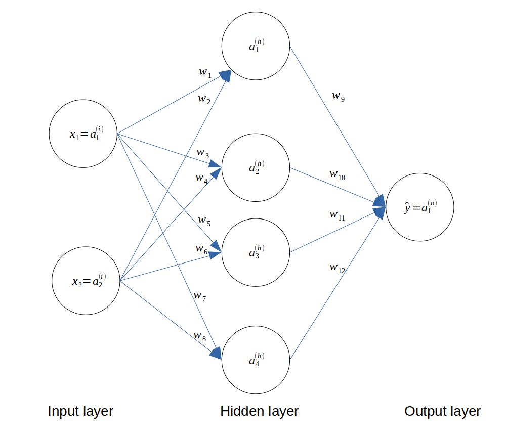
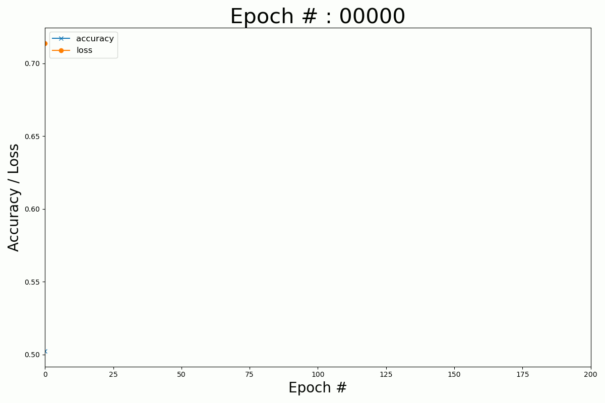

# Neural networks from scratch in Python

In these series of tutorials, we will learn how to implement simple artifical neural network in Python.

## Installation

```bash
pip install -r requirements.txt
```

## 1. Single Layer Perceptron

[blog post](https://www.datasparked.com/deep%20learning/Implement-a-neural-network-in-Python/) - [source code](./1_single_layer_perceptron/)


## 2. Non-linear classification

[blog post](https://www.datasparked.com/deep%20learning/Non-linear-classification-with-neural-networks/) - [source code](./2_non_linear_binary_classification/)

Perform non-linear classification with a neural network implemented in pure Numpy.




## 3. Multi-class classification

[blog post](https://www.datasparked.com/deep%20learning/Multi-class-classification-with-neural-networks/) - [source code](./3_multiclass_classification/)


Perform multi-class classification with a neural network implemented in pure Numpy.


## 4. Non-linear classification with Pytorch

[blog post](https://www.datasparked.com/deep%20learning/Classification-with-Pytorch/) - [source code](./4_non_linear_classification_pytorch)

Non-linear classification with Pytorch.


## 5. Non-linear classification with Keras

[blog post](https://www.datasparked.com/deep%20learning/Classification-with-Keras/) - [source code](./5_non_linear_classification_keras/)





