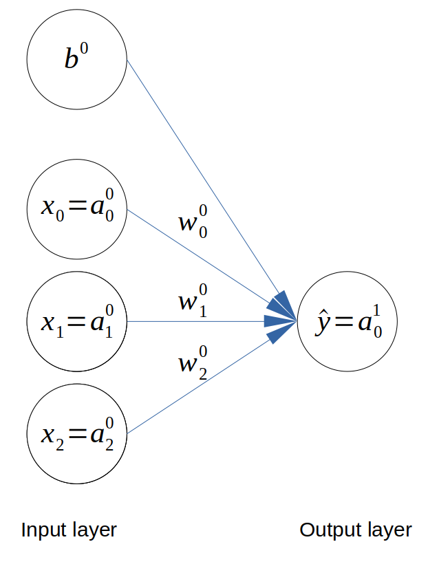
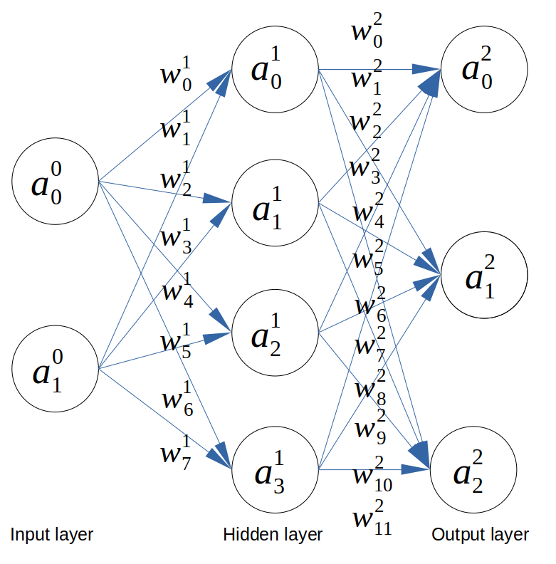

# Neural networks from scratch in Python

In these series of tutorials, we will learn how to implement simple artifical neural network in Python using only Numpy.

## Installation

```bash
pip install -r requirements.txt
```

## 1. Single Layer Perceptron

Please refer to [this article](https://www.datasparked.com/deep%20learning/Implement-a-neural-network-in-Python/) for more details.



```bash
python 1_simple_NN.py
```

## 2. Non-linear classification

Please refer to [this article](https://www.datasparked.com/deep%20learning/Non-linear-classification-with-neural-networks/) for more details.


```bash
python 2_non_linear_binary_classification.py
```

## 3. Multi-class classification

Please refer to [this article](datasparked.com/deep%20learning/Multi-class-classification-with-neural-networks/) for more details.



```bash
python 3_multiclass_classification.py
```


